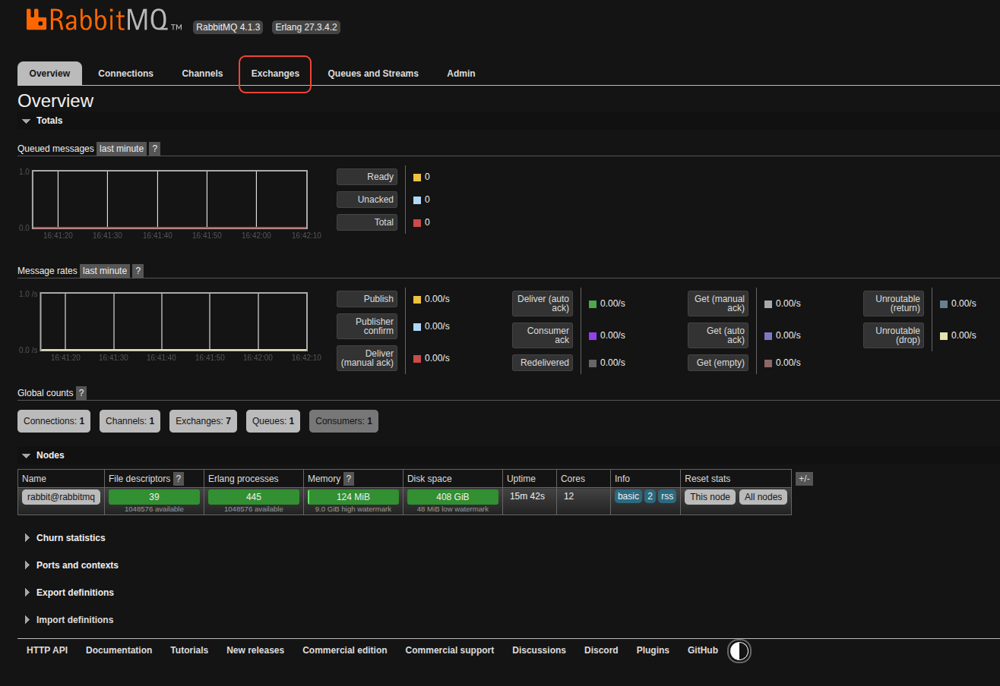
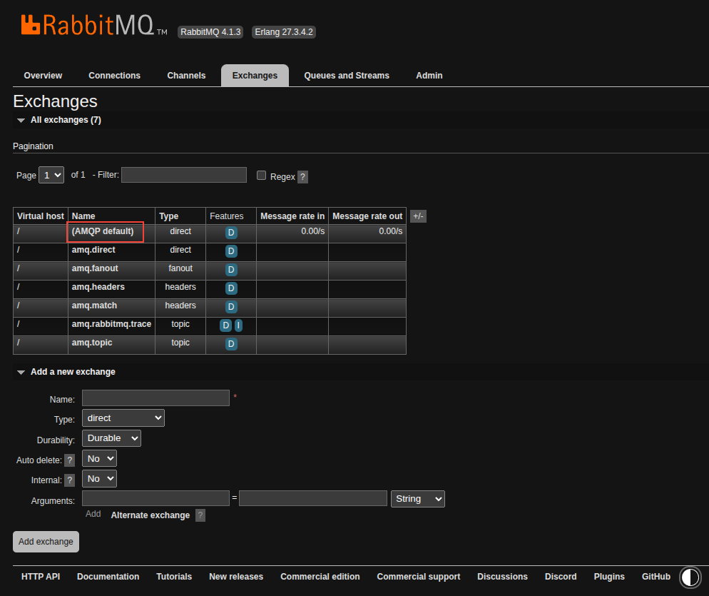
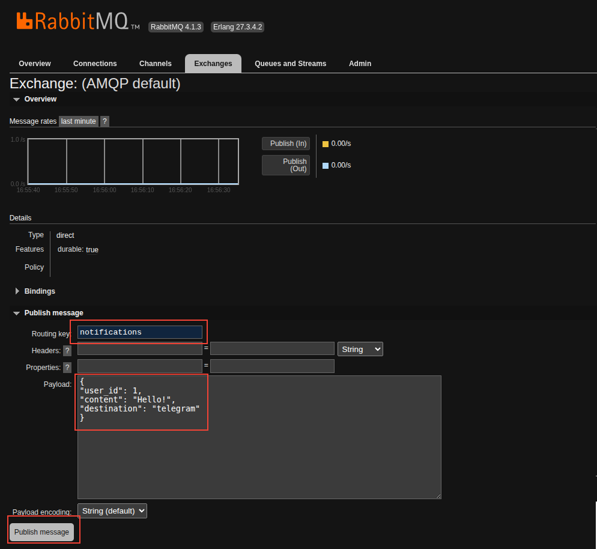

# Система уведомлений

## Описание

Сервис предназначен для отправки уведомлений пользователям. Пользователь может получать уведомления через

- Email
- SMS
- Telegram

Способ отправки можно указать явно. Если один из способов не сработает, будет пробоваться другой

## Запуск

Клонируем репозиторий:

```shell
git clone git@github.com/settlermine/notification_system
```

Для корректной работы нужно заполнить переменные окружения в файле .env. Необходимые переменные находятся в файле .env.example

Сервис запускается через docker compose. В терминале корневой директории пишем команду

```shell
docker compose up -d
```

После этого можно проверить корректность запуска. Вводим команду:

```shell
docker compose logs app
```

В консоли появится сообщение "Service is ready to consume messages". Это означает, что сервис запущен

Далее нужно инициализировать таблицы в базе. Для этого, выполняем команду

```shell
docker compose run --rm python cli.py init-db
```

После этого в базе должна появиться таблица users с аттрибутами id, email, telegram_id, phone_number. Сервис не обладает функционалом создания и редактирования пользователей. Своего пользователя можно добавить через любой клиент для Posrgres.

Теперь сервис полностью функционирует

## Использование

Взаимодействие с сервисом происходит через очереди RabbitMQ. Для отправки тестового сообщения через браузер переходим на url `http://localhost:15672/`. В появившемся окне авторизации вводим username и password указанные в переменных окружения `RABBITMQ_USER `и `RABBITMQ_PASSWORD `соответственно. Нажимаем `Login`. Должна появитсья панель управления RabbitMQ. Переходим на вкладку `Exchanges`:



В таблице жмем на (AMQP default)



Открывается окно, через которое можно отправить тестовое сообщение. В `Routing key` пишем название очереди `notifications`. В `payload` вставляем json следующей структуры:

```json
{
	"user_id": 1, # id пользователя в БД. Обязательный параметр
	"content": "Hello!", # Текст сообщения. Обязательный параметр
	"destination": "telegram", # Канал получения сообщения. Доступные варианты: telegram, sms, email. Необязательный параметр
}
```

После этого, нажимаем `Publish message`:



Должны увидеть сообщение `Message pubhished`. После этого проверяем логи командой:

```shell
docker compose logs app
```

Если все прошло успешно увидим лог `Notification send successfully` уровня `info`. Если возникла ошибка, будет лог уровня `error` с описанием ошибки.

Также, можно запустить отправку уведомлений в обход RabbitMQ. Для этого пишем команду

```shell
docker compose run --rm app python cli.py send-notification --user-id 1 --content "Hello!" --destination "telegram"
```
